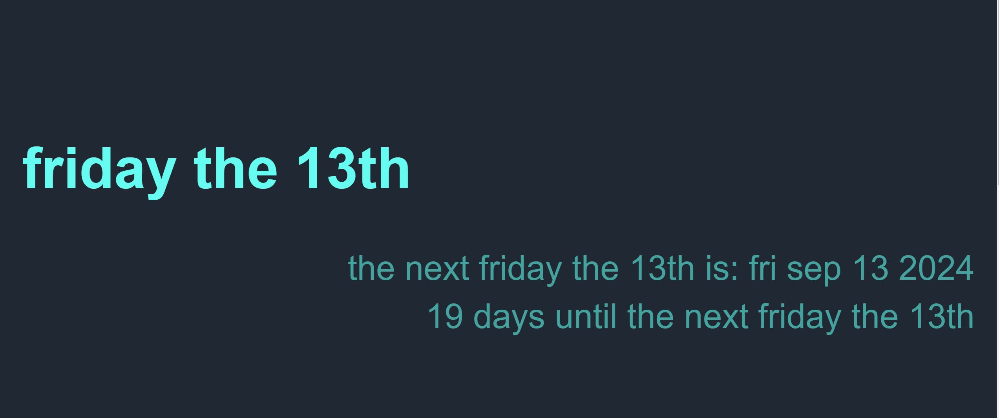

# Friday the 13th Finder

This project is a simple webpage that calculates and displays the next occurrence of Friday the 13th. The page also shows how many days remain until that date.

## Features

- **Next Friday the 13th Calculation**: The script automatically calculates the next occurrence of Friday the 13th from the current date.
- **Days Until Next Friday the 13th**: Displays the number of days remaining until the next Friday the 13th.
- **Custom Styling**: The webpage features a custom font and a dark-themed design.
- **Embedded Wikipedia Information**: The page includes an embedded Wikipedia article that provides additional information about Friday the 13th.

## Project Structure

- **HTML (`index.html`)**: The main structure of the webpage, including placeholders for the calculated date and the countdown.
- **CSS (inlined)**: Custom styles for the webpage, including a dark color scheme and custom fonts.
- **JavaScript**: A script to calculate the next Friday the 13th and the number of days until then.

## How to Use
- download the repo files
- open the index.html file in a browser

